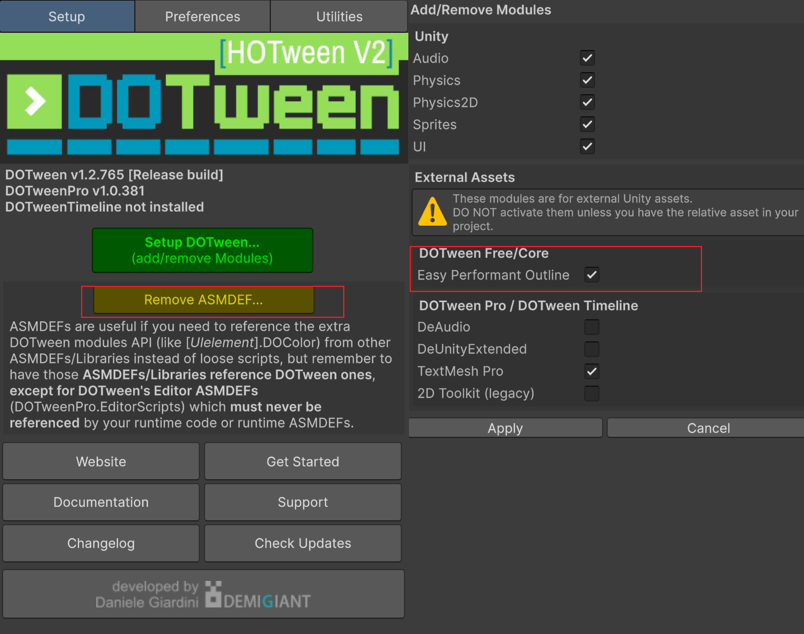

# Cheems Unity Frame

个人在学习过程中积累和整理的 Unity 工具与代码库，旨在提供便捷的开发框架与常用功能封装。  
本项目参考并借鉴了多个优秀的开源框架，在此基础上调整了命名规则与部分方法逻辑，使其更贴合个人的开发习惯与思路。  

> **注意**：本项目暂无完整文档，处于持续更新与优化中。

---

## 🛠️相关插件

**[NuGetForUnity](https://github.com/GlitchEnzo/NuGetForUnity)**

**[R3](https://github.com/Cysharp/R3)**

**[UniTask](https://github.com/Cysharp/UniTask)**

**[Odin Inspector and Serializer]( https://assetstore.unity.com/packages/tools/utilities/odin-inspector-and-serializer-89041)**

**[Odin Validator](https://assetstore.unity.com/packages/tools/utilities/odin-validator-227861)**

**[DOTween Pro](https://assetstore.unity.com/packages/tools/visual-scripting/dotween-pro-32416)**

**[Easy Performant Outline](https://assetstore.unity.com/packages/vfx/shaders/fullscreen-camera-effects/easy-performant-outline-2d-3d-urp-hdrp-and-built-in-renderer-157187)**

---

## 📚 参考与致谢

以下项目为本框架提供了重要的参考与灵感（排名不分先后）：

- **[JKFrame](https://github.com/Joker-YF/JKFrame)** – 主要参考和引用框架
- **[SKCell](https://github.com/Skyrim07/SKCell)**
- [GameFramework](https://github.com/EllanJiang/GameFramework)
- [UnitySingleton](https://github.com/UnityCommunity/UnitySingleton)

衷心感谢这些优秀的开源项目作者的分享与贡献！🙏

---

## 使用

1. 目前没有一键配置的功能，先确保项目中有已经安装如下插件
 ```toml
Unity Package：
Addressables  = 2.7.2

Other Package:
Odin Inspector and Serializer = 3.3.1.13
Easy Performant Outline = 3.6.2
DOTween = 1.2.765
 ```
2. 开启 DOTween 对 EPO的兼容，并添加 ASMDEF文件

	

3. 通过git链接将此项目导入到UPM中

	在unity package manager中输入

	 `https://github.com/Goatherd0072/CheemsFrame.git`
	
	或在 根目录`Packages/manifest.json`文件中添加
	
	 `"com.cheems.framework": "https://github.com/Goatherd0072/CheemsFrame.git"`.


---